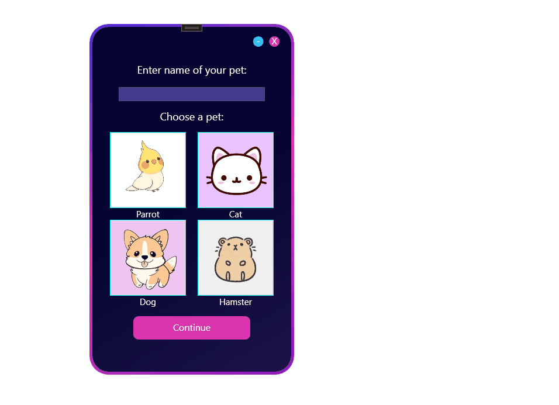
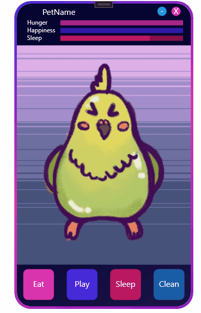

# 🐾 Desktop Tamagotchi

A cute desktop pet built with WPF (C#). It has needs, moods, and a personality!  
This is one of my favorite projects — I completed it from start to finish, and it turned out adorable ✨

---

## 🎯 What it does

- Shows a pet that changes emotions depending on hunger and mood
- Needs care over time: feeding, playing, etc.
- Reacts to your actions with animations and sound (For some animals tho)
- Simple, cozy interface with hand-picked visuals and sounds

---

## 🧰 Tech stack

- **Language:** C#
- **Framework:** WPF (.NET)
- **Design:** XAML + handmade assets
- **Other:** Sound effects, timers, basic state machine

---

## 💡 Why I made it

This was a side project to explore desktop UI programming.  
I wanted to make something interactive, visual, and a little nostalgic — like the toys I loved growing up.

It helped me:
- Practice C# and WPF
- Work with state, timers, and UI updates
- Wrap a whole project in visuals and personality

---

## 🚀 How to run

> 💻 Requires Windows and .NET Framework (or .NET Core if adapted)

1. Clone the repo  
2. Open in Visual Studio  
3. Build and run — the pet will greet you! 🐣

---

## 📸 Screenshots

  
*You can move the app window around, select the pet and pets name*

  
*Player can interract with the pet in different ways*

---

## 📝 Lessons learned

This was the first time I built a complete UI-driven app in C#.  
I practiced:
- Using sound and animation to build feedback
- Managing user input and pet behavior

It also taught me that **finishing projects** feels *really* good 💪

---

## 🧸 Future ideas

- Add animations and different images for different animals
- Add mini-games (e.g. ball throwing)
- Save/load pet progress
- Add random events (like the pet asking questions or telling jokes!)

---

## 💬 Feedback welcome!

I'm always happy to hear suggestions, feedback or ideas! You can [open an issue](https://github.com/roukorjerte/Tamagochi/issues/new) or contact me directly.

---
